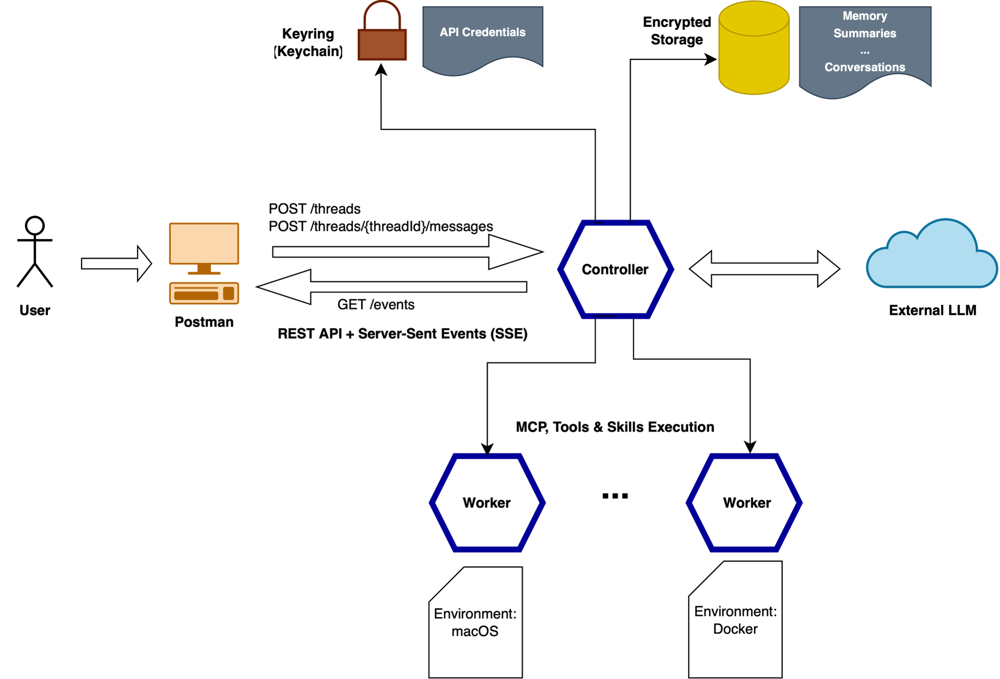

# 🐟 Robalo
.NET-powered secure AI Agent

## Architecture

The architecture includes two main services: *Controller* and **Worker*.

### Controller

Controller will handle the communication with the user via REST API with server-sent events (SSE) e.g. via Postman, and will route requests to the External LLM (local or cloud). 
All conversation history, memory, summaries will be stored in an encrypted storage, and API Credentials (e.g. API keys or Auth token to an LLM) will be stored in a system-default keyring, e.g. macOS Keychain with appropriate permissions.

Any tool execution, including via MCP servers, and skills, will be executed in the Worker, ideally running on a separate machine, or at least under a different unprivileged user. Multiple workers will be supported, e.g. there could be one working on a Mac, and another running inside a Docker container.

The communication between Controller and Workers will be based on gRPC.

### External LLM

This will be an LLM as configured by the user, that the Controller will use to process prompts. This can either be a cloud LLM provider (e.g. OpenAI or Anthropic), or a locally installed model.

### Keyring

Keyring denotes a default OS credentials store, such as the Keychain on macOS. It will be used to store sensitive credentials, such as API keys to external LLM providers.

### Encrypted storage

NoSQL Database will be used to store and encrypt all conversations, memory data and possibly summaries. 

## Requirements

Create a secure AI agent using .NET and Microsoft Agent Framework (successor of Semantic Kernel) with support for workflows (Graph Engineering), privacy mode for handling personal data (PII), rich logging, kill switches and secure credential handling.

### Workflows

The AI agent will support both chat mode (Prompt Engineering) and workflow mode (Graph Engineering).

### Process Isolation

The AI Agent will contain two isolated processes:
1. The AI Agent Controller which will handle the LLM requests
2. The AI Agent Worker which will execute tools, including the command line, but will not have conversation history or any LLM credentials stored locally.

Ideally, the AI Agent Worker would be running either on dedicated hardware, in a Docker container, or at a minimum, under a different user from the AI Agent Controller.

For the Privacy Mode, all requests will be executed in the AI Agent Controller, since it has less chance of being compromised, since the AI Agent Workers would by default be untrusted due to the use of tools, such as the command line. 

### Privacy Mode

The AI will support an additional Privacy Mode by allowing configuring a separate LLM (ideally, locally hosted) to process sensitive data. This would prevent data processed in this mode from being sent into the Cloud.

Even when a local model is used, sensitive data could still be inadvertently leaked, when used with unsecure tools. Consider a workflow which fetches private email data, summarizes them and then searches the web. If the search tool is not properly configured, it could send out the summary of email data to the search engine, leaking private data. Thus, the privacy mode should only allow proven tools. 

Also, the result of the workflow in the privacy mode should ideally be output into a separate secure channel, not on Telegram or Whatsapp.

```mermaid
flowchart TB
    subgraph unsafe["Flow 1 — Local LLM, but data can still leak"]
        direction LR
        A["Private emails"] --> B["Local LLM"]
        B --> C["Sensitive summary"]
        C --> D["Unrestricted web search"]
        D --> E["External search engine<br/>receives private information"]
        C --> F["Telegram / WhatsApp<br/>receives sensitive results"]
    end

    subgraph secure["Flow 2 — Protected Privacy Mode"]
        direction LR
        G["Private emails"] --> H["Separate, locally hosted<br/>Privacy Mode LLM"]
        H --> I["Sensitive summary"]
        I --> J["Tool policy gate"]
        J --> K["Approved tools only<br/>No sensitive data leaves<br/>the trusted environment"]
        J --> L["Blocked: external search<br/>with sensitive content"]
        K --> M["Secure private channel<br/>Access-controlled results"]
    end

    classDef sensitive fill:#fff3cd,stroke:#b8860b,color:#332600
    classDef danger fill:#fde2e2,stroke:#c62828,color:#7f0000
    classDef safe fill:#e2f3e5,stroke:#2e7d32,color:#123c16

    class A,C,G,I sensitive
    class D,E,F,L danger
    class H,J,K,M safe
```

 
### Logging

The AI Agent comes with built-in structured logging and tracing for both troubleshooting and auditing purposes. Especially when trying to get an AI agent to work with local models, it could sometimes be challenging to understand and fix any compatibilities.

### Credential Handling

The AI Agent will store all credentials, such as API Keys or authentication tokens, in a default key ring store with sufficient permissions. On macOS it will use the Keychain app and it will allow only the AI Agent process to allow those credentials. Any unsolicited substitution or alterations of the AI Agent process would trigger the macOS GateKeeper. Thus, even if the host where the AI agent is running were to be compromised, no credentials could be harvested.

### Conversation History

All conversations (sessions) will be stored encrypted. Thus, even if the host where the AI Agent is running were to be compromised, no data could be harvested.

### Integrity and Code Modification

Both AI Agent Controller and AI Agent Worker will ship as one-file .NET executables to prevent file substitution or alteration. This especially addresses vulnerability with Node.JS-agents, where a user is able to edit Javascript files and restart the agent for changes to take effect without confirmation.

### Internal AI

The AI Agent will incorporate a small AI model to be used to troubleshoot requests to the main external LLM. This built-in AI will only be used as a heuristic helper to try to get e.g. local models working with the AI agent, as different models may come with different syntax requirements.
The built-in AI model will be integrated and non-substitutable and will only enhance the Controller troubleshooting logic.
Potentially, the built-in AI model could also be made available to use in the Privacy Mode.

### Kill switch

At any point during request or workflow execution, the user should be able to request a status and request a cancellation. E.g., if a request is being run in a loop to process data, the user still should be able to request the status in the chat or ask it to stop. The infamous example is OpenClaw running a delete operation on emails and ignoring the user's STOP request.
Even if the LLM is busy, the user must always have the opportunity to inquire about the current status and cancel the request mid-process.

### Guardrails

The AI Agent will aim for having most guardrails implemented as hard guardrails in code, not as soft guardrails submitted to the LLM. Especially when it comes to routing of chat messages, in case of parallel threads or groups, it should not be the LLM to decide where to forward the messages, but the Controller. In fact, OpenClaw used (as of March 2026) to have soft guardrails sent as a prompt to the LLM to ensure correct message routing.