# 🐟 Robalo
.NET-powered secure AI Agent

## Requirements

Create a secure AI agent using .NET and Microsoft Agent Framework (successor of Semantic Kernel) with support for worklows (Graph Engineering), privacy mode for handling personal data (PII), rich logging, kill switches and secure credential handling.

### Workflows

The AI agent will support both chat mode (Prompt Engineering) and workflow mode (Graph Engineering).

### Privacy Mode

The AI will support an additional Privacy Mode by allowing configuring a separate LLM (ideally, locally hosted) to process sensitive data. This would prevent from data processed in this mode to be sent into the Cloud.

Even when local model is used, sensitive data could still be inadvertently leaked, when using with unsecure tools. Consider, a workflow which fetches private email data, summarizes them and then searches the web. If the search tool is not properly configured, it could send out the summary of email data to the search engine, leaking private data. Thus, the privacy mode should only allow proven tools. 

Also, the result of the worklow in the privacy mode, should ideally be output into a separate secure channel, not on Telegram or Whatsapp.

 
```mermaid
flowchart TB
    subgraph unsafe["Flow 1 — Local LLM, but data can still leak"]
        direction LR
        A["Private emails"] --> B["Local LLM"]
        B --> C["Sensitive summary"]
        C --> D["Unrestricted web search"]
        D --> E["External search engine<br/>receives private information"]
        C --> F["Telegram / WhatsApp<br/>receives sensitive results"]
    end

    subgraph secure["Flow 2 — Protected Privacy Mode"]
        direction LR
        G["Private emails"] --> H["Separate, locally hosted<br/>Privacy Mode LLM"]
        H --> I["Sensitive summary"]
        I --> J["Tool policy gate"]
        J --> K["Approved tools only<br/>No sensitive data leaves<br/>the trusted environment"]
        J --> L["Blocked: external search<br/>with sensitive content"]
        K --> M["Secure private channel<br/>Access-controlled results"]
    end

    classDef sensitive fill:#fff3cd,stroke:#b8860b,color:#332600
    classDef danger fill:#fde2e2,stroke:#c62828,color:#7f0000
    classDef safe fill:#e2f3e5,stroke:#2e7d32,color:#123c16

    class A,C,G,I sensitive
    class D,E,F,L danger
    class H,J,K,M safe
```

### Logging

The AI Agent comes with built-in structured logging and tracing for both troubleshooting and auditing purposes. Especially, when trying to get an AI agent work with local models, it could sometimes be challenging to understand and fix any compatibilities.

### Credential Handling

The AI Agent will store all credentials, such as API Keys or authentication tokens, in a default key ring store with sufficient permissions. On macOS it will use the Keychain app and it will allow only the AI Agent process to allow those credentials. Any unsolicited substitution or alterations of the AI Agent process would trigger the macOS GateKeeper. Thus, even if the host where AI agent is running were to be compromised, no credentials could be harvested.

### Conversation History

All conversations (sessions) will be stored encrypted. Thus, even if the host where AI Agent is running were to be compromised, no data could be harvested.

### Process Isolation

The AI Agent will contain two isolated processes:
1. The AI Agent Controller (Cabeca) which would handle the LLM requests
2. The AI Agent Worker (Fin) which would execute tools, including the command line, but will not have conversation history nor any LLM credentials stored locally.

Ideally, the AI Agent Worker would be running eaither on a dedicated hardware, in a docker container, or at a minimum, in a different user from the AI Agent Controller.

For the Privacy Mode, all requests will be executed in the AI Agent Controller (Cabeca), since it has less chance to be compromised, since the AI Agent Workers would by default be untrusted due to the use of tools, such as command line. 

### Integrity and Code Modification

Both AI Agent Controller (Cabeca) and AI Agent Worker (Fin) will ship as one-file .NET executables to prevent file substitution or alteration.

### Internal AI

The AI Agent will incorporate a small AI model to be used to troubleshoot requests to the main external LLM. This built-in AI will only be used as a heuristic helper to try to get e.g. local models working with the AI agent, as different models may come with different syntax requirements.
The built-in AI model will be integrated and non-substitutable and will only enhance the Controller troubleshooting logic.
Potentially, the built-in AI model could also be made available to use in the Privacy Mode.